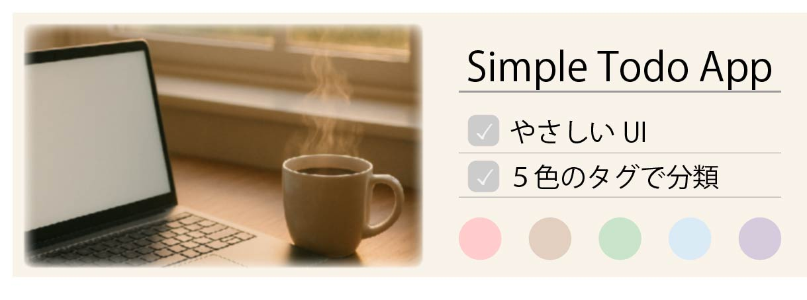
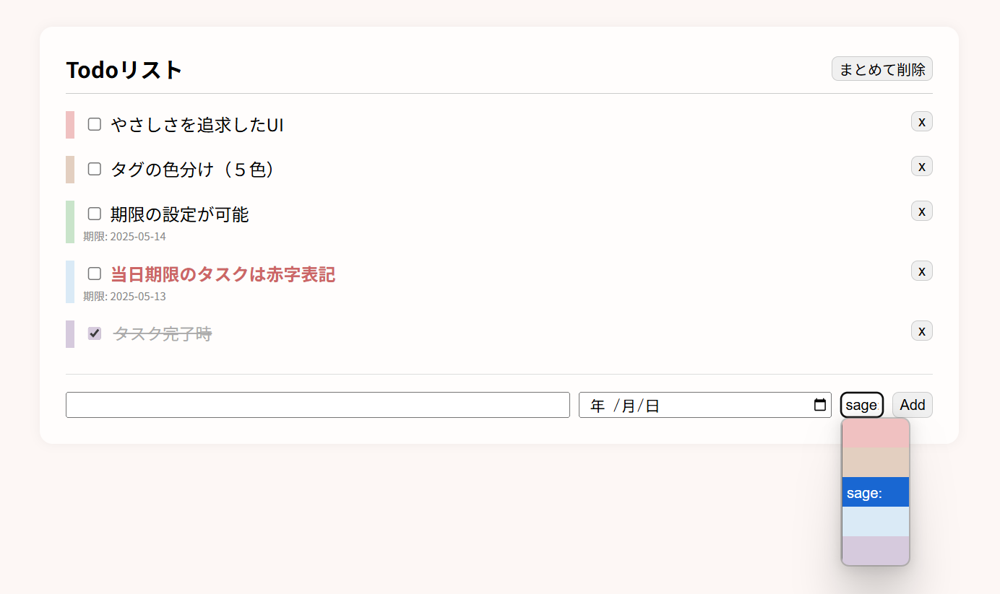

## 📝 概要
日々のタスクをシンプルに、でも気持ちよく管理したい。  
このアプリは「安心感」と「わかりやすさ」を大切にしたToDoアプリです。

## 🔗 アプリURL  
▶ [デモを見る](https://miz-ssn.github.io/simple-todo-app/)

## 📚 参考にした教材  
このアプリは [ドットインストール](https://dotinstall.com/) をベースに、自分なりのアレンジや機能追加を加えて制作しました。

## 💡 開発背景  
転職活動中にポートフォリオを作成する中で、自分が毎朝使っているTodoリストを、JavaScriptで再現してみようと考えました。
デザイン面でもUIの設計にこだわり、心理的に焦燥感に駆られることなく、シンプルで見やすいよう調整しました。

## 🙍 想定ユーザー  
PCで作業をするクリエーターや在宅ワーカーを想定。  
１日の始まりや作業中に確認して、安心できることを意識してUIを整えました。

## 🔧 主な機能

### ✅ Todoの追加・削除・一括削除  
テキスト入力・日付選択・タグ選択を1画面で操作可能。
タスクを入力して、Addボタンで登録。不要なものは×ボタンで削除、☑したものの一括削除も可能です。  

---

### 🎨 タグの色分け（追加機能）  
タスクは5色で分類可能。帯とチェックマークの色が連動しており、視認性を高めています。
色は統一感がありつつも、見分けやすくて安心感を与える色を選びました。

---

### 📅 期限入力と色変化 （追加機能） 
期限設定が可能。  
当日になるとタスクの文字色が**落ち着いた赤**に変化し、ストレスを与えず注意喚起してくれます。  

---

### 🎨 UIデザイン  
「落ち着いたトーンで安心できる」をテーマに、配色や余白バランスに配慮しました。

---

## 🚀 使用技術  
- HTML / CSS / JavaScript（バニラ）  
- GitHub Pages によるホスティング  

## 🔭 今後の展望  
- タグ機能によるフィルター  
- Reactを用いた再構築と状態管理の学習  
- UIアニメーション・アクセシビリティ対応も検討中  

---

このアプリは、**フロントエンドエンジニア**を目指しJavaScriptを学ぶ中で、エンジニアの第一歩として制作しました。  
今後も、UI設計へのこだわりと「使いやすさ」を意識したコード実装を積み重ねていきます。
